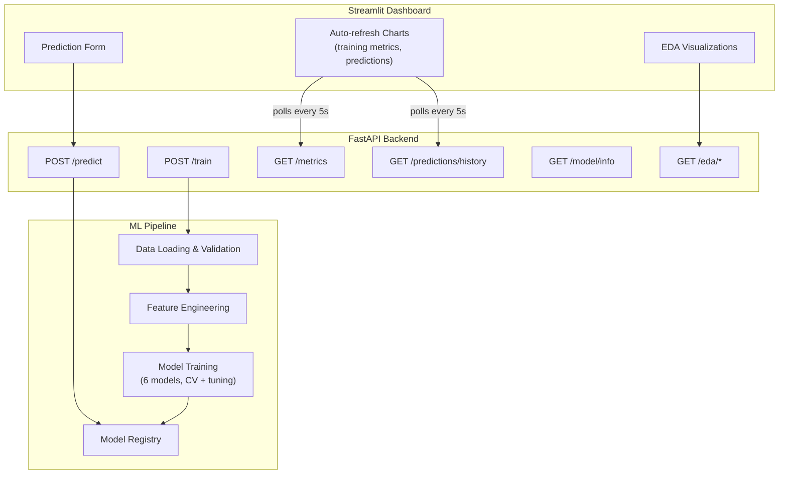

# 🏠 House Price Predictor

A full-stack house price prediction system: a proper scikit-learn/XGBoost ML pipeline, a FastAPI backend, and a Streamlit dashboard with auto-refreshing charts that track training progress and prediction history in real time.

Built on the Kaggle **Ames Housing** dataset schema (`train.csv`, ~1460 rows, 80 features, target `SalePrice`).

---

## Architecture



Training runs as a FastAPI `BackgroundTask`. The trainer writes progress to `models/training_metrics.json` after every model finishes cross-validating; `GET /metrics` reads that file; the dashboard polls it every 5 seconds and re-renders the charts via `st.rerun()`.

---

## Project Structure

```
house_price_predictor/
├── data/
│   ├── raw/            # Put train.csv here (not committed — see .gitignore)
│   └── processed/
├── ml/                 # ML pipeline: config, data loading, features, training, registry
├── api/                # FastAPI backend: routes, schemas, shared state
├── dashboard/           # Streamlit frontend: app.py + 3 pages + chart components
├── models/              # Saved model.joblib, metadata, training log (gitignored)
├── tests/                # pytest suite — 43 tests across ml/ and api/
└── requirements.txt
```

---

## Setup

```bash
# 1. Create a virtual environment
python3 -m venv .venv
source .venv/bin/activate   # Windows: .venv\Scripts\activate

# 2. Install dependencies
pip install -r requirements.txt

# 3. Add the dataset
#    Download the Kaggle Ames Housing dataset (train.csv) and place it at:
#    data/raw/train.csv
```

Get the dataset from Kaggle's [House Prices - Advanced Regression Techniques](https://www.kaggle.com/c/house-prices-advanced-regression-techniques/data) competition (requires a free Kaggle account), or via the Kaggle CLI:

```bash
kaggle competitions download -c house-prices-advanced-regression-techniques -p data/raw --unzip
```

---

## Running It

**Terminal 1 — start the API:**
```bash
uvicorn api.main:app --reload
```
Swagger docs at [http://localhost:8000/docs](http://localhost:8000/docs).

**Terminal 2 — start the dashboard:**
```bash
streamlit run dashboard/app.py
```
Opens at [http://localhost:8501](http://localhost:8501).

**Then:**
1. Go to **Training Monitor**, click **Start Training**. Watch the RMSE convergence and model comparison charts update every 5 seconds as each model finishes.
2. Once training completes, go to **Predict**, fill in house features, and get a price estimate with a confidence range and feature-importance breakdown.
3. Check **EDA** to explore the dataset — correlations, distributions, missing values.

---

## Models Trained

| Model | Tuned via |
|---|---|
| Linear Regression | (no hyperparameters) |
| Ridge | `alpha` |
| Lasso | `alpha` |
| Random Forest | `n_estimators`, `max_depth`, `min_samples_leaf` |
| Gradient Boosting | `n_estimators`, `learning_rate`, `max_depth` |
| XGBoost | `n_estimators`, `learning_rate`, `max_depth` |

Each is cross-validated with 5-fold CV (`RandomizedSearchCV` by default — see `SEARCH_STRATEGY` in `ml/config.py` to switch to exhaustive `GridSearchCV`). The model with the lowest mean CV RMSE (on the log-transformed target) is saved as the active model.

---

## API Reference

| Endpoint | Description |
|---|---|
| `POST /predict` | Predict price for a single house; returns point estimate + 95% interval + top feature importances |
| `GET /predictions/history` | Last N predictions with timestamps |
| `POST /train` | Trigger background training (optionally pass `{"models": [...]}` to train a subset) |
| `GET /metrics` | Live training progress — per-model, per-fold metrics |
| `GET /model/info` | Metadata for the currently active model |
| `GET /eda/summary` | Dataset shape, target stats, missing-value summary |
| `GET /eda/correlations` | Top features correlated with `SalePrice` |
| `GET /eda/distributions` | Histogram data for key features + target |

Full interactive docs at `/docs` once the API is running.

---

## Testing

```bash
pytest tests/ -v              # full suite
pytest tests/test_feature_engineering.py -v
pytest tests/test_model_trainer.py -v
pytest tests/test_api.py -v
```

43 tests cover: feature engineering correctness (engineered columns, ordinal mapping, NaN handling, unseen categories at inference time), model training (CV shape, hyperparameter search, best-model selection, metrics logging), and the API (prediction validation, confidence intervals, history, error states).

---

## Notes & Design Decisions

- **Predictions are stored in-memory**, not a database — they reset on API restart. Fine for a demo; swap in SQLite if you want persistence across restarts.
- **Log-transformed target**: `SalePrice` is right-skewed, so the pipeline trains on `log1p(SalePrice)` and inverse-transforms predictions back to dollars. Reported RMSE/MAE in training metrics are on the log scale.
- **CORS is wide open** (`allow_origins=["*"]`) for local development and the planned React frontend upgrade. Tighten this before deploying anywhere public.
- **Confidence intervals** are a simple ±1.96×(CV RMSE) band on the log scale, not a proper prediction interval from quantile regression — good enough for a dashboard gauge, not for real underwriting decisions.

---

## Roadmap

- **Phase 2**: React frontend (the FastAPI CORS setup and JSON contracts are already React-ready).
- Optional: SQLite persistence for prediction history, model versioning beyond "one active model," quantile regression for proper prediction intervals.
